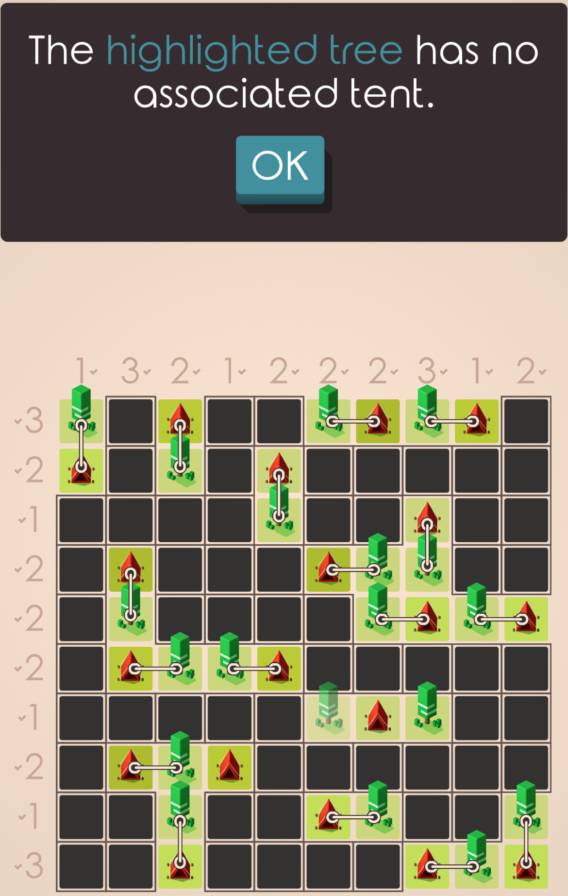

# Mathematical Model Documentation

This document provides a formal mathematical programming formulation of the Tents and Trees puzzle as a Mixed Integer Programming (MIP) problem.

## Problem Definition

Given:
- An **m × n** grid representing the puzzle board
- **Row tent requirements** R = {r₁, r₂, ..., rₘ} where rᵢ is the required number of tents in row i
- **Column tent requirements** C = {c₁, c₂, ..., cₙ} where cⱼ is the required number of tents in column j
- **Tree positions** T ⊆ {(i,j) : 1 ≤ i ≤ m, 1 ≤ j ≤ n} representing the locations of all trees on the board

**Objective:** Find tent positions that satisfy all Tents and Trees puzzle rules.

## Sets and Indices

| Symbol | Definition |
|--------|------------|
| **I** | Set of row indices: I = {1, 2, ..., m} |
| **J** | Set of column indices: J = {1, 2, ..., n} |
| **T** | Set of tree positions: T ⊆ I × J |
| **P** | Set of potential tent positions (tent candidates) |
| **G** | Set of tree groups: G = {G₁, G₂, ..., Gₖ} where each Gᵢ ⊆ T |
| **A(i,j)** | Adjacent cells to position (i,j): horizontally and vertically neighboring |
| **S(i,j)** | Surrounding cells to position (i,j): all 8 neighboring positions |
| **C(i,j)** | Cross-pattern cells around (i,j): adjacent + diagonal + two-steps away in adjacent direction |
| **U(t,G)** | Unshared adjacent tiles for tree t in group G |

### Tent Candidate Set
The set of valid tent positions is defined as:

```
P = {(i,j) ∈ I × J : (i,j) ∉ T and A(i,j) ∩ T ≠ ∅}
```

This ensures tents can only be placed adjacent to at least one tree.

### Tree Groups
Trees are grouped based on cross-pattern connectivity:

```
Gₖ = connected component of trees where ∀t₁,t₂ ∈ Gₖ, ∃ path through cross-pattern adjacency
```

### Unshared Adjacent Tiles
For tree t in group G, unshared adjacent tiles are:

```
U(t,G) = A(t) \ (⋃_{t'∈G,t'≠t} A(t) ∩ A(t')) \ G
```

## Decision Variables

| Variable | Domain | Definition |
|----------|--------|------------|
| **x_{i,j}** | {0, 1} | 1 if a tent is placed at position (i,j) ∈ P, 0 otherwise |

## Objective Function

This is a constraint satisfaction problem where the goal is to find a feasible solution that satisfies all constraints without optimizing any particular objective. Therefore, we define the objective function as:

```
minimize 0
```

## Constraints

### 1. Tent-Tree Balance Constraint
The total number of tents must equal the number of trees:

```
Σ_{(i,j) ∈ P} x_{i,j} = |T|
```

### 2. Tree Adjacency Constraints
Each tree must have at least one adjacent tent:

```
Σ_{(k,l) ∈ A(i,j) ∩ P} x_{k,l} ≥ 1    ∀(i,j) ∈ T
```

### 3. Tent Separation Constraints
No tent can be placed adjacent to another tent (including diagonally):

```
Σ_{(k,l) ∈ S(i,j) ∩ P} x_{k,l} ≤ M · (1 - x_{i,j})    ∀(i,j) ∈ P
```

Where M = |S(i,j) ∩ P| is the number of surrounding tent candidates.

### 4. Row Sum Constraints
Each row must contain exactly the required number of tents:

```
Σ_{j: (i,j) ∈ P} x_{i,j} = rᵢ    ∀i ∈ I
```

### 5. Column Sum Constraints  
Each column must contain exactly the required number of tents:

```
Σ_{i: (i,j) ∈ P} x_{i,j} = cⱼ    ∀j ∈ J
```

### 6. Tree Group Balance Constraints
For each group of connected trees, the number of tents in their combined adjacent area equals the group size:

```
Σ_{(k,l) ∈ (⋃_{t∈Gₖ} A(t)) ∩ P} x_{k,l} = |Gₖ|    ∀Gₖ ∈ G
```

### 7. Unshared Tile Constraints
For trees with unshared adjacent tiles, limit to at most one tent in unshared positions:

```
Σ_{(k,l) ∈ U(t,Gₖ)} x_{k,l} ≤ 1    ∀t ∈ Gₖ, ∀Gₖ ∈ G, |U(t,Gₖ)| > 1
```

## Why Tree Group and Unshared Tile Constraints Are Necessary

The basic constraints (1-5) are not sufficient to ensure valid Tents and Trees solutions. Without constraints 6 and 7, the model can produce solutions that violate fundamental puzzle rules:

### Problem: Invalid Solutions Without Advanced Constraints

When using only constraints 1-5, valid solutions to the model may exist where:
- **One tree has multiple adjacent tents** (violating the one-tent-per-tree rule)
- **One tent is shared between multiple trees** (violating proper tent-tree pairing)



### Solution: Two Complementary Constraint Types

#### Tree Group Balance Constraints (Constraint 6)
These constraints ensure that each group of connected trees has exactly the right number of tents in their combined adjacent area. This prevents both:
- Trees having too many tents
- Tents being inappropriately shared between trees


#### Unshared Tile Constraints (Constraint 7)
These constraints prevent individual trees from claiming multiple tents in areas not shared with other trees in their group:


### Constraint Redundancy

Adding either constraint 6 or 7 individually results in the model producing the correct solution for the example shown above.

However, the Tree Group Balance Constraint appears more powerful, as it directly addresses the problems in both problematic tree groups, whereas the Unshared Tile Constraint only affects one of the groups.

Both constraint types are retained in the formulation because:
- Unshared Tile Constraints never invalidate correct solutions
- They may help in edge cases not yet fully analyzed
- They could improve solver efficiency through additional constraint propagation

## Complete MIP Formulation

**Variables:**
```
x_{i,j} ∈ {0,1}    ∀(i,j) ∈ P
```

**Objective:**
```
minimize 0
```

**Subject to:**
```
Σ_{(i,j) ∈ P} x_{i,j} = |T|                                     (Tent-tree balance)

Σ_{(k,l) ∈ A(i,j) ∩ P} x_{k,l} ≥ 1                              ∀(i,j) ∈ T     (Tree adjacency)

Σ_{(k,l) ∈ S(i,j) ∩ P} x_{k,l} ≤ |S(i,j) ∩ P| · (1 - x_{i,j})   ∀(i,j) ∈ P     (Tent separation)

Σ_{j: (i,j) ∈ P} x_{i,j} = rᵢ                                   ∀i ∈ I         (Row sums)

Σ_{i: (i,j) ∈ P} x_{i,j} = cⱼ                                   ∀j ∈ J         (Column sums)

Σ_{(k,l) ∈ (⋃_{t∈Gₖ} A(t)) ∩ P} x_{k,l} = |Gₖ|                  ∀Gₖ ∈ G        (Tree group balance)

Σ_{(k,l) ∈ U(t,Gₖ)} x_{k,l} ≤ 1                                 ∀t ∈ Gₖ, ∀Gₖ ∈ G, |U(t,Gₖ)| > 1  (Unshared trees)

x_{i,j} ∈ {0,1}                                                 ∀(i,j) ∈ P     (Binary variables)
```

## Implementation Notes

- **Mathematical indexing**: This formulation uses 1-based indexing for mathematical clarity (rows 1 to m, columns 1 to n)
- **Implementation mapping**: The actual Python implementation uses 0-based indexing (rows 0 to m-1, columns 0 to n-1)
- **Tree grouping**: Trees are grouped using depth-first search on cross-pattern connectivity  
- **Constraint naming**: Each constraint type has systematic naming in the solver for easy identification
- **Big-M formulation**: Tent separation uses the actual count of surrounding candidates rather than a fixed M
- **Solver type**: Defaults to using SCIP optimizer through OR-Tools
